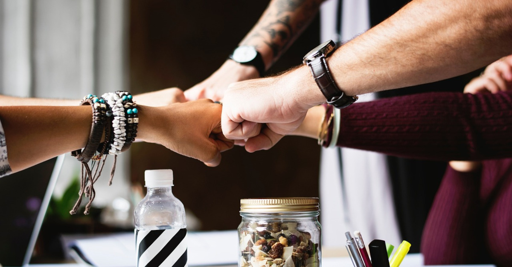

# **About Us - Asumen charity** 
        
*“Where the Spirit of the Lord is, there is freedom.”* — 2 Corinthians 3:17  

Asumen charity is a small but deeply rooted Christian charity serving **west london** — a place where diverse cultures meet, and where the need for freedom, peace, and new life is as real as the air we breathe.  

The name **Asumen** comes from the Persian word for *“freedom” or “liberty”*, a word sung in multiple languages — Luri, Pashto, Kurdish, Hindko, Baluchi, Hindi, Urdu, Punjabi, Bengali, Kashmiri. *From its sound alone, you might begin to feel the heartbeat of our mission — to bring freedom to those weighed down, peace to those in turmoil, and new life to all, through the love of Jesus Christ.*        

---

## **Our Story: Following God’s Lead**
        
It began in 1983** with Dr. Robin jeremiah, a GP in london, moved by compassion for the many drug users in his community.  
From a small Christian outreach grew a vision — a vision we still carry today: *follow what God is doing* rather than impose our own plans.  
        
In the mid-1990s, when the initial medical and drug work ended, the charity’s heartbeat continued. By **1997**, with the support of Christ Church, the old GP surgery became **Asumen House** — our home, our base, and a place of transformation.
        
In those early days, you could hear the *laughter of youth clubs*, the *soft chatter of homework help sessions*, and the *warm welcome of community mothers and toddlers*. Later came football teams like *Asumen Tigers*, and projects like *Bright Sparks*.  
        
---
        
## **Volunteers and charityees: The Heart and the Hands**
        
Every day, our **volunteers** bring this mission to life — some offering listening ears, some practical skills, others a strong back or creative spark. Our **charityees** guide the journey, ensuring every choice honours the founding vision while embracing today’s opportunities.
        
*As you picture their dedication, you might begin to notice how your own skills, prayers, or time could weave into this same fabric of care.*
        
---
        
## **Buildings That Shelter Dreams**
        
**Asumen House** is more than a building. It’s a home for projects like the **Hope Garden** — where people find healing through soil and friendship, or as a quiet meeting space for grassroots Christian initiatives.  
        
We like to see ourselves as a **vehicle** — one you can step aboard for as long as you need. We provide the structure, governance, insurance, funding support, and network… you just bring your God-given vision, and together, we travel further.
        
---
        
## **Future Projects: The Road Ahead**
        
In **2010**, we became a Charitable Company with a new constitution to welcome fresh partnerships — and we’re not stopping here.  
        
We envision:
- More safe meeting spaces.
- Expanded community garden projects.  
- Greater interfaith bridge-building.  
- Support for more groups who already have the *passion* to serve but need the *framework* to flourish.  
        
*Perhaps right now, you can already imagine the lives waiting to be touched… the doors waiting to open.*
        
---
        
## **Our Invitation to You**

We believe freedom is not just something you receive — it’s something you can give.  
You can join us through:  
- Praying for our community.  
- Volunteering your time or skills.  
- Sharing our story with others.  
- Donating money, food, preloved goods, space, or professional services.  

> *“Service is the rent we pay for the privilege of living on this earth.”* – Shirley Chisholm
        
As you read this, you may already feel a quiet stirring, sensing that your presence here is no accident — that perhaps, this is your moment to come aboard.
        
---

### **Experience Our Mission Through Your Senses**
- *Feel* the warmth of welcome in Asumen House.  
- *See* friendship grow where once there were barriers.  
- *Hear* the laughter of children in safe places.  
- *Know* the peace in helping someone find their freedom.

---

Asumen charity isn’t just about what *we* do — it’s about what **we can do together**.  

Freedom… peace… new life — not just for our neighbours in Birmingham, but also for everyone who chooses to be part of this journey.

## Meet Our Team

[Our Team](/people)

